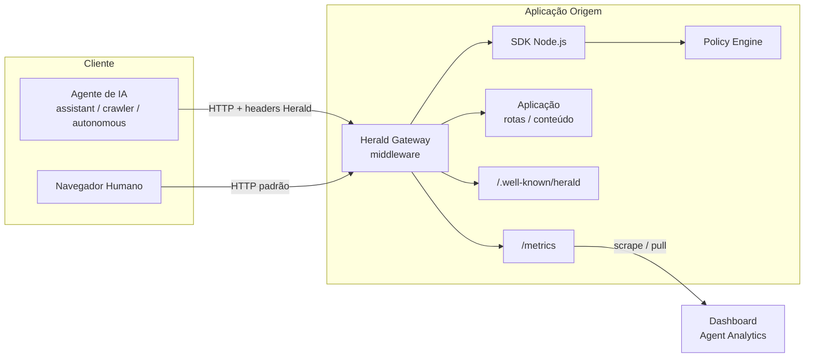
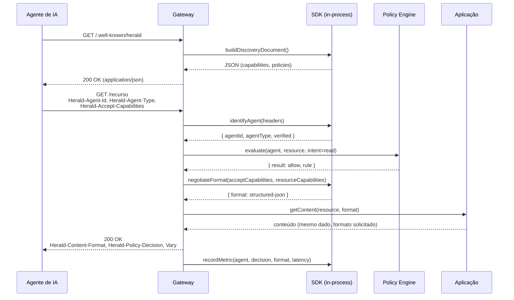
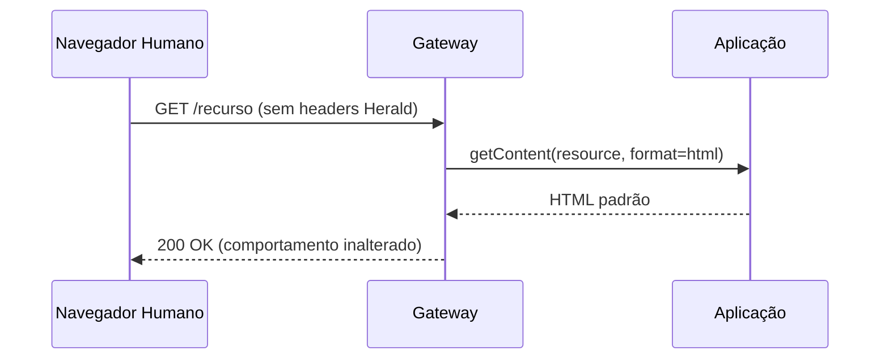

# Arquitetura do Herald Protocol

> Referência normativa: [RFC-0001](./RFC-0001.md). Este documento descreve a arquitetura
> de referência que implementa o protocolo — não é normativo, mas reflete as decisões de
> design da implementação de referência (SDK, Gateway, Policy Engine, Dashboard).

## 1. Visão Geral dos Componentes

A arquitetura de referência do Herald Protocol é composta por quatro componentes que podem
ser adotados de forma independente ou em conjunto:

| Componente | Papel | Onde roda |
|---|---|---|
| **SDK Node.js** | Biblioteca que implementa identificação, negociação e emissão de métricas; usada por quem constrói o Gateway ou integra o Herald Protocol direto na aplicação | No processo da aplicação origem |
| **Gateway** | Middleware/proxy de referência que usa o SDK para aplicar o Herald Protocol em qualquer app Express/HTTP sem alterar o código da aplicação | Na borda da aplicação origem (middleware) ou como proxy reverso dedicado |
| **Policy Engine** | Avalia políticas (intents × agente × recurso) e retorna decisões (`allow`/`deny`/`ask`) consumidas pelo Gateway | Embutido no Gateway (biblioteca) ou como serviço separado para deployments multi-origem |
| **Dashboard (Agent Analytics)** | App web que lê métricas agregadas emitidas pelo Gateway e exibe acessos por agente, decisões de política e formatos servidos | Serviço separado, consome `/metrics` do(s) Gateway(s) |

Esses componentes mapeiam diretamente aos 5 pilares definidos no projeto Herald Protocol:
identificação de agentes, negociação de capacidades e formato, Policy Engine, analytics, e
Gateway/SDK de referência.

## 2. Diagrama de Componentes



### 2.1 Responsabilidades por componente

**SDK Node.js**
- Parsing e validação dos headers Herald (`Herald-Agent-Id`, `Herald-Agent-Type`,
  `Herald-Accept-Capabilities`).
- Fallback de identificação via `User-Agent` contra padrões conhecidos.
- Interface para consultar o Policy Engine e obter uma decisão.
- Seleção de capacidade/formato a partir da negociação (RFC-0001 §5.4).
- Emissão de eventos de métrica (contadores, latência) via uma interface plugável
  (in-memory para a PoC, Prometheus client para produção).
- Geração do documento de descoberta a partir de configuração declarativa.

**Gateway**
- Middleware Express (ou compatível com `(req, res, next)`) que orquestra o SDK em cada
  requisição.
- Expõe `/.well-known/herald` e `/metrics` automaticamente.
- Aplica os headers de resposta (`Herald-Content-Format`, `Herald-Policy-Decision`, `Vary`).
- Não força uma capacidade específica sobre a aplicação — delega a transformação de
  conteúdo (HTML → JSON estruturado) para adaptadores configuráveis pela aplicação.

**Policy Engine**
- Estrutura de regras em árvore de precedência (recurso → agent-id → agent-type →
  default), conforme RFC-0001 §8.3.
- Avaliação pura (sem I/O) para permitir uso em hot path com baixa latência.
- Interface de configuração declarativa (JSON/YAML) e, futuramente, API de administração.

**Dashboard (Agent Analytics)**
- Consome métricas expostas pelo Gateway (`/metrics`, formato Prometheus).
- Exibe: requisições por agente/tipo, decisões de política por resultado, distribuição de
  formato servido, taxa de erro e latência.
- Desacoplado do Gateway — pode agregar métricas de múltiplas origens.

## 3. Fluxo de Request/Response

### 3.1 Sequência de negociação



### 3.2 Caminho de negação de política

Quando o Policy Engine resolve `deny` ou `ask`, o Gateway curto-circuita antes de chamar a
aplicação — a lógica de negócio nunca é executada para requisições negadas, reduzindo custo
e superfície de ataque.

```mermaid
sequenceDiagram
    participant Agent as Agente de IA
    participant GW as Gateway
    participant PE as Policy Engine

    Agent->>GW: GET /recurso (intent=train via Herald-Agent-Type=crawler)
    GW->>PE: evaluate(agent, resource, intent=train)
    PE-->>GW: { result: deny, rule: by_agent_type.crawler }
    GW-->>Agent: 403 Forbidden<br/>Herald-Policy-Decision: intent=train; result=deny; rule=...
```

### 3.3 Caminho de cliente sem Herald (compatibilidade)



## 4. Decisões de Design

### 4.1 Middleware, não fork da aplicação

O Gateway é implementado como middleware que envolve a aplicação existente, não como uma
reescrita ou proxy obrigatório. Isso reduz o custo de adoção — uma aplicação Express
existente adiciona uma linha (`app.use(heraldGateway(config))`) sem alterar rotas.

**Alternativa considerada e descartada**: proxy reverso standalone (estilo Envoy/Nginx)
como único modo de deployment. Descartado como *obrigatório* pois adiciona um salto de
rede e complexidade operacional desnecessária para o MVP; permanece como opção para Fase 3
avançada (deployments multi-serviço).

### 4.2 Policy Engine como biblioteca pura, não serviço externo (na PoC)

Para a PoC e Fase 3, o Policy Engine roda in-process como função pura (regras → decisão),
evitando I/O de rede no hot path. Um modo "serviço remoto" fica como extensão futura
(`extensions.policy_engine.remote_url` no documento de descoberta), para cenários
multi-origem com política centralizada.

### 4.3 Transformação de conteúdo é responsabilidade da aplicação, não do Gateway

O Gateway negocia *qual* formato deve ser servido, mas não tenta converter HTML
arbitrário em JSON estruturado automaticamente — isso seria frágil e poderia violar o
princípio de "conteúdo inalterado" (RFC-0001 §7). A aplicação registra adaptadores
(`registerFormatter(resourceType, format, fn)`) que sabem gerar cada formato a partir da
mesma fonte de dados.

### 4.4 Métricas in-memory na PoC, Prometheus-compatible por padrão

A interface de métricas do SDK é plugável. A PoC usa um coletor in-memory simples; a
interface já é compatível com `prom-client`, permitindo troca sem mudança de API para
produção.

### 4.5 Discovery document estático por padrão, dinâmico como extensão

`/.well-known/herald` é servido a partir de configuração estática por padrão (arquivo
JSON), priorizando previsibilidade e cacheabilidade (RFC-0001 §6.2). Geração dinâmica por
requisição é suportada, mas não é o caminho padrão.

## 5. Modelo de Dados Interno

### 5.1 Regra de política (Policy Rule)

```ts
interface PolicyRule {
  scope: "default" | "agent_type" | "agent_id" | "resource";
  match: string; // ex: "crawler", "anthropic-claude/1.0", "/artigos/*"
  intents: {
    read?: "allow" | "deny" | "ask" | "not-applicable";
    train?: "allow" | "deny" | "ask" | "not-applicable";
    redistribute?: "allow" | "deny" | "ask" | "not-applicable";
    monetize?: "allow" | "deny" | "ask" | "not-applicable";
  };
  rate_limit?: { requests: number; window_seconds: number };
}
```

### 5.2 Registro de agente identificado (Agent Context)

```ts
interface AgentContext {
  agentId: string | null;
  agentType: "assistant" | "crawler" | "autonomous" | "search-index" | "unknown";
  verified: boolean; // true apenas com assinatura válida (RFC-0001 §4.4)
  source: "herald-header" | "user-agent-fallback";
}
```

## 6. Extensibilidade Arquitetural

- Novos tipos de agente e intents são adicionados sem alterar a interface do Policy
  Engine — `match` e `intents` são strings/objetos abertos, validados por schema mas não
  hardcoded no motor de avaliação.
- Formatadores de conteúdo são registrados pela aplicação (plugin pattern), permitindo
  suportar novos formatos (`streaming`, `graphql`) sem alterar o Gateway.
- O Dashboard consome apenas o formato de métricas exposto (`/metrics`), permitindo
  substituir a implementação do Gateway sem alterar o Dashboard, desde que o contrato de
  métricas seja mantido.

## 7. Deployment

Para a PoC (Fase 1–3), o modelo de deployment recomendado é:

```
[Cliente] → [Aplicação Node.js com Gateway como middleware] → [Policy Engine in-process]
                                                              → [/metrics] → [Dashboard]
```

Para produção em Fase 4+, o Gateway pode ser extraído como proxy reverso independente na
frente de múltiplas origens, com Policy Engine centralizado — mantendo o mesmo contrato de
headers definido no RFC-0001, sem exigir mudanças nos agentes clientes.
