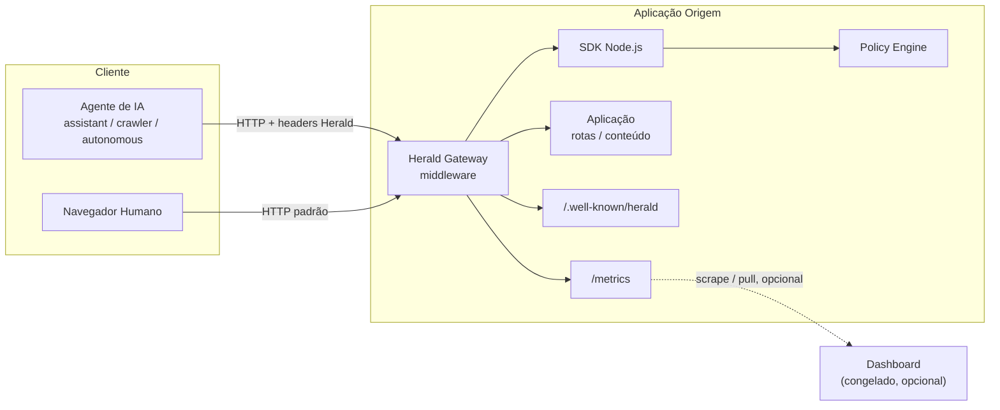
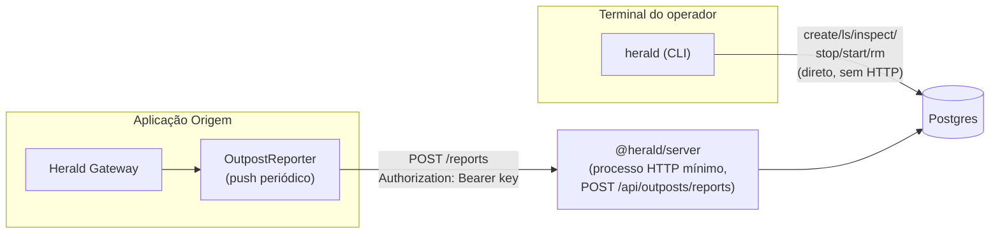
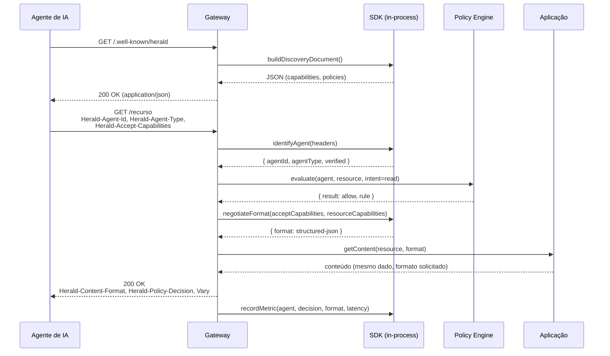
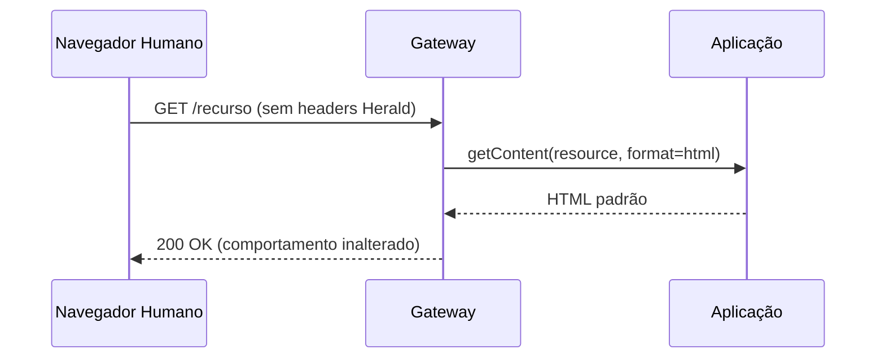

# Arquitetura do Herald Protocol

> Referência normativa: [RFC-0001](./RFC-0001.md). Este documento descreve a arquitetura
> de referência que implementa o protocolo — não é normativo, mas reflete as decisões de
> design da implementação de referência: núcleo do protocolo (SDK, Gateway, Policy
> Engine) e control plane opcional (Server, CLI, Prometheus Adapter, Dashboard congelado).

## 1. Visão Geral dos Componentes

A arquitetura de referência do Herald Protocol é composta por dois grupos de componentes,
independentes entre si: o **núcleo do protocolo** (identificação, negociação, política —
roda embutido em qualquer app, sem infraestrutura própria) e o **control plane opcional**
(gestão de identidades "Outpost" e histórico de métricas via push, backed by Postgres —
só existe se você optar por ele).

### 1.1 Núcleo do protocolo

| Componente | Papel | Onde roda |
|---|---|---|
| **SDK Node.js** (`@herald/sdk`) | Biblioteca que implementa identificação, negociação e emissão de métricas; usada por quem constrói o Gateway ou integra o Herald Protocol direto na aplicação | No processo da aplicação origem |
| **Gateway** (`@herald/gateway`) | Middleware/proxy de referência que usa o SDK para aplicar o Herald Protocol em qualquer app Express/HTTP sem alterar o código da aplicação | Na borda da aplicação origem (middleware) ou como proxy reverso dedicado |
| **Policy Engine** | Avalia políticas (intents × agente × recurso) e retorna decisões (`allow`/`deny`/`ask`) consumidas pelo Gateway | Embutido no Gateway (biblioteca) ou como serviço separado para deployments multi-origem |

Esses três componentes mapeiam diretamente aos 5 pilares definidos no projeto Herald
Protocol: identificação de agentes, negociação de capacidades e formato, Policy Engine,
analytics, e Gateway/SDK de referência. Funcionam sozinhos, sem nenhum dos componentes
abaixo — "self-hosting zero infra" continua verdadeiro pro núcleo do protocolo.

### 1.2 Control plane opcional (identidade "Outpost" + observabilidade)

| Componente | Papel | Onde roda |
|---|---|---|
| **Server** (`@herald/server`) | Control plane backed by Postgres — dupla função: **biblioteca** (`PgOutpostStore`/`PgReportsStore`, usada pelo CLI pra falar direto com o banco) e **processo HTTP mínimo** (uma rota só, `POST /api/outposts/reports`, recebe push de métricas autenticado por Outpost key) | Biblioteca: import direto pelo CLI. Processo: standalone, atrás de HTTPS em produção |
| **CLI** (`@herald/cli`, comando `herald`) | Provisiona/gerencia Outposts direto no Postgres (`create`/`ls`/`inspect`/`stop`/`start`/`rm`, prefix matching tipo `docker`) — nunca passa por HTTP pra isso. `outpost init`/`init` geram o `.env` (`HERALD_SERVER_URL`+`HERALD_OUTPOST_KEY`) que a app monitorada usa em runtime | Terminal do operador |
| **Prometheus Adapter** (`@herald/prometheus`) | `MetricsCollector` alternativo ao in-memory, backed by `prom-client` — expõe `GET /metrics` do Gateway em formato de texto Prometheus/OpenMetrics em vez de JSON. Agrega só por `agent_type` (evita cardinalidade sem limite de `agentId`) | No processo da aplicação origem, junto com o Gateway (pacote opcional) |
| **Dashboard (Agent Analytics)** — **congelado** | App web com gráficos que lê métricas via *polling* de `/metrics` de Gateways individuais. Congelado desde a decisão de priorizar CLI + Postgres sem UI — continua existindo e funcionando pro caso de uso original, mas não recebe desenvolvimento novo | Serviço separado, consome `/metrics` do(s) Gateway(s) via poll |

Diferença central de modelo: Dashboard faz **poll** (puxa `/metrics` periodicamente,
precisa alcançar a rede de cada Gateway); Server faz **push** (a app monitorada empurra
métricas pra ele, funciona através de firewall corporativo outbound-only). Não são a
mesma coisa nem se substituem — são dois caminhos de observabilidade paralelos, cada um
com seu próprio trade-off de rede.

## 2. Diagrama de Componentes

### 2.1 Núcleo do protocolo (sem control plane)



### 2.2 Control plane opcional (Outpost — CLI + Server + Postgres)



CLI nunca fala com o processo HTTP do Server — só com o Postgres, direto, via
`--database-url`/`herald configure`. A app monitorada nunca fala com o Postgres — só com
o Server via HTTP, autenticada pela Outpost key (`HERALD_SERVER_URL`/`HERALD_OUTPOST_KEY`
no `.env`, gerados por `herald outpost init`). Nenhum dos dois lados tem acesso ao que só
o outro precisa.

### 2.3 Responsabilidades por componente

**SDK Node.js**
- Parsing e validação dos headers Herald (`Herald-Agent-Id`, `Herald-Agent-Type`,
  `Herald-Accept-Capabilities`).
- Fallback de identificação via `User-Agent` contra padrões conhecidos.
- Interface para consultar o Policy Engine e obter uma decisão.
- Seleção de capacidade/formato a partir da negociação (RFC-0001 §5.4).
- Emissão de eventos de métrica (contadores, latência) via uma interface plugável
  (`MetricsCollector`) — `InMemoryMetricsCollector` (default, JSON) ou
  `PrometheusMetricsCollector` de `@herald/prometheus` (opcional, texto Prometheus), sem
  mudar nenhum outro código do SDK/Gateway pra trocar.
- Geração do documento de descoberta a partir de configuração declarativa.

**Gateway**
- Middleware Express (ou compatível com `(req, res, next)`) que orquestra o SDK em cada
  requisição.
- Expõe `/.well-known/herald` e `/metrics` automaticamente — `/metrics` responde JSON
  (`InMemoryMetricsCollector` default) ou texto Prometheus (se `config.metrics` implementa
  `renderPrometheus()`, duck-typed — ver `@herald/prometheus`), `501` pra qualquer outro
  `MetricsCollector` customizado sem essa capacidade.
- Aplica os headers de resposta (`Herald-Content-Format`, `Herald-Policy-Decision`, `Vary`).
- Não força uma capacidade específica sobre a aplicação — delega a transformação de
  conteúdo (HTML → JSON estruturado) para adaptadores configuráveis pela aplicação.
- Opcionalmente empurra o snapshot de métricas pra um `@herald/server` periodicamente
  (`config.reporting`, fluxo Outpost — ver §2.2), independente do que `/metrics` expõe.

**Policy Engine**
- Estrutura de regras em árvore de precedência (recurso → agent-id → agent-type →
  default), conforme RFC-0001 §8.3.
- Avaliação pura (sem I/O) para permitir uso em hot path com baixa latência.
- Interface de configuração declarativa (JSON/YAML) e, futuramente, API de administração.

**Server (`@herald/server`) — control plane opcional**
- Biblioteca (`PgOutpostStore`, `PgReportsStore`, `createPool`, `migrate`) — usada pelo
  CLI pra criar/listar/inspecionar/pausar/revogar Outposts direto no Postgres, sem HTTP.
- Processo HTTP mínimo (`npm start`) — uma rota só, `POST /api/outposts/reports`,
  autenticada por `Authorization: Bearer <outpost-key>`. `401` (key errada/desconhecida)
  ou `403 outpost_stopped` (key válida, Outpost pausado via `herald outpost stop`).
- Schema idempotente (`CREATE TABLE`/`ALTER TABLE ... ADD COLUMN IF NOT EXISTS`), sem
  framework de migração — 2 tabelas (`outposts`, `outpost_reports`), aplicado a cada
  `migrate()` (chamado no boot do processo HTTP e em toda invocação do CLI).

**CLI (`@herald/cli`, comando `herald`)**
- `herald configure` — roda uma vez, aplica o schema e salva `DATABASE_URL` em
  `~/.herald/config.json`; comandos seguintes não precisam mais de `--database-url`.
- `herald outpost create/init/ls/inspect/stop/start/rm` — CRUD + pausa reversível direto
  no Postgres. `<id>` aceita prefixo (tipo `docker`), erro explícito se ambíguo.
- `herald init` — grava `.env` (`HERALD_SERVER_URL`+`HERALD_OUTPOST_KEY`) numa app já com
  Outpost criado, sem precisar rodar `create` de novo.

**Prometheus Adapter (`@herald/prometheus`)**
- `PrometheusMetricsCollector` — implementa a mesma interface `MetricsCollector` do SDK,
  backed by `prom-client`. Agrega só por `agent_type` (nunca `agentId` — cardinalidade sem
  limite é anti-padrão conhecido do Prometheus).
- Reconhecido pelo `GET /metrics` do Gateway via duck-typing (`renderPrometheus()`), sem
  `@herald/sdk`/`@herald/gateway` precisarem depender de `prom-client`.

**Dashboard (Agent Analytics) — congelado**
- Consome métricas expostas pelo Gateway via poll (`/metrics`, JSON —
  `InMemoryMetricsCollector.snapshot()`, não Prometheus).
- Exibe: requisições por agente/tipo, decisões de política por resultado, distribuição de
  formato servido, taxa de erro e latência.
- Desacoplado do Gateway — pode agregar métricas de múltiplas origens. Congelado desde a
  decisão de priorizar CLI+Postgres sem UI (§1.2) — continua funcionando, sem
  desenvolvimento novo.

## 3. Fluxo de Request/Response

### 3.1 Sequência de negociação



### 3.2 Caminho de negação de política

Quando o Policy Engine resolve `deny` ou `ask`, o Gateway curto-circuita antes de chamar a
aplicação — a lógica de negócio nunca é executada para requisições negadas, reduzindo custo
e superfície de ataque.

```mermaid
sequenceDiagram
    participant Agent as Agente de IA
    participant GW as Gateway
    participant PE as Policy Engine

    Agent->>GW: GET /recurso (intent=train via Herald-Agent-Type=crawler)
    GW->>PE: evaluate(agent, resource, intent=train)
    PE-->>GW: { result: deny, rule: by_agent_type.crawler }
    GW-->>Agent: 403 Forbidden<br/>Herald-Policy-Decision: intent=train; result=deny; rule=...
```

### 3.3 Caminho de cliente sem Herald (compatibilidade)



## 4. Decisões de Design

### 4.1 Middleware, não fork da aplicação

O Gateway é implementado como middleware que envolve a aplicação existente, não como uma
reescrita ou proxy obrigatório. Isso reduz o custo de adoção — uma aplicação Express
existente adiciona uma linha (`app.use(heraldGateway(config))`) sem alterar rotas.

**Alternativa considerada e descartada**: proxy reverso standalone (estilo Envoy/Nginx)
como único modo de deployment. Descartado como *obrigatório* pois adiciona um salto de
rede e complexidade operacional desnecessária para o MVP; permanece como opção para Fase 3
avançada (deployments multi-serviço).

### 4.2 Policy Engine como biblioteca pura, não serviço externo (na PoC)

Para a PoC e Fase 3, o Policy Engine roda in-process como função pura (regras → decisão),
evitando I/O de rede no hot path. Um modo "serviço remoto" fica como extensão futura
(`extensions.policy_engine.remote_url` no documento de descoberta), para cenários
multi-origem com política centralizada.

### 4.3 Transformação de conteúdo é responsabilidade da aplicação, não do Gateway

O Gateway negocia *qual* formato deve ser servido, mas não tenta converter HTML
arbitrário em JSON estruturado automaticamente — isso seria frágil e poderia violar o
princípio de "conteúdo inalterado" (RFC-0001 §7). A aplicação registra adaptadores
(`registerFormatter(resourceType, format, fn)`) que sabem gerar cada formato a partir da
mesma fonte de dados.

### 4.4 Métricas in-memory por padrão, Prometheus como adaptador opcional

A interface de métricas do SDK (`MetricsCollector`) é plugável desde o início. O default
(`InMemoryMetricsCollector`, JSON) cobre a PoC e o caso simples sem infraestrutura extra.
`@herald/prometheus` implementa a mesma interface com `prom-client` — pacote separado
(não dependência do SDK/Gateway), só instalado por quem opta por Prometheus. Agrega por
`agent_type`, não por `agentId` — cardinalidade sem limite de `agentId` (uma série nova
por bot/versão distinta observada) é anti-padrão conhecido do Prometheus.

### 4.5 Discovery document estático por padrão, dinâmico como extensão

`/.well-known/herald` é servido a partir de configuração estática por padrão (arquivo
JSON), priorizando previsibilidade e cacheabilidade (RFC-0001 §6.2). Geração dinâmica por
requisição é suportada, mas não é o caminho padrão.

### 4.6 Control plane via push, não polling (Outpost)

O Dashboard original faz *polling* — precisa alcançar a rede de cada Gateway configurado
(`HERALD_GATEWAYS`). Isso não funciona atrás de firewall corporativo outbound-only, um
cenário real de deployment. O fluxo Outpost inverte: a app monitorada empurra métricas
periodicamente pro `@herald/server` (`config.reporting` no Gateway,
`POST /api/outposts/reports`) — só precisa de conexão outbound, nenhuma porta inbound
exposta na app monitorada. Trade-off: push não é "tempo real" (intervalo configurável,
default 60s) e exige um processo `@herald/server` no ar continuamente pro dado chegar
(diferente das operações de CRUD do CLI, que não dependem dele — ver §4.7).

### 4.7 CLI fala direto com Postgres, não com o Server via HTTP

Decisão revisitada depois da primeira versão do control plane (que tinha `POST/GET/DELETE
/api/outposts` como rotas HTTP, espelhando o Dashboard original): criar/listar/inspecionar/
pausar/revogar um Outpost virou operação direta do CLI contra o Postgres
(`--database-url`/`herald configure`), não mais HTTP. Motivo: são operações do operador
humano, não da app monitorada — não precisam da mesma superfície de rede que o push de
métricas precisa, e cada rota HTTP a mais é superfície de ataque que não se paga sem um
consumidor real além do próprio CLI. O processo HTTP do `@herald/server` encolheu pra uma
rota só (`POST /api/outposts/reports`), a única que serve um consumidor genuinamente
remoto (a app monitorada, potencialmente numa rede diferente da do operador).

## 5. Modelo de Dados Interno

### 5.1 Regra de política (Policy Rule)

```ts
interface PolicyRule {
  scope: "default" | "agent_type" | "agent_id" | "resource";
  match: string; // ex: "crawler", "anthropic-claude/1.0", "/artigos/*"
  intents: {
    read?: "allow" | "deny" | "ask" | "not-applicable";
    train?: "allow" | "deny" | "ask" | "not-applicable";
    redistribute?: "allow" | "deny" | "ask" | "not-applicable";
    monetize?: "allow" | "deny" | "ask" | "not-applicable";
  };
  rate_limit?: { requests: number; window_seconds: number };
}
```

### 5.2 Registro de agente identificado (Agent Context)

```ts
interface AgentContext {
  agentId: string | null;
  agentType: "assistant" | "crawler" | "autonomous" | "search-index" | "unknown";
  verified: boolean; // true apenas com assinatura válida (RFC-0001 §4.4)
  source: "herald-header" | "user-agent-fallback" | "none"; // "none" = provável humano
}
```

### 5.3 Outpost e histórico de reports (Postgres, `@herald/server`)

```sql
CREATE TABLE outposts (
  id            TEXT PRIMARY KEY,     -- 12 hex chars
  name          TEXT NOT NULL,
  key_hash      TEXT NOT NULL UNIQUE, -- SHA-256 da key; texto puro nunca persistido
  key_prefix    TEXT NOT NULL,        -- só pra exibição (ex: "hrld_op_a1b2c3")
  created_at    TIMESTAMPTZ NOT NULL DEFAULT now(),
  last_seen_at  TIMESTAMPTZ,          -- atualizado a cada push aceito
  active        BOOLEAN NOT NULL DEFAULT true -- false = "herald outpost stop" (reversível)
);

CREATE TABLE outpost_reports (
  id            BIGSERIAL PRIMARY KEY,
  outpost_id    TEXT NOT NULL REFERENCES outposts(id) ON DELETE CASCADE,
  reported_at   TIMESTAMPTZ NOT NULL,
  snapshot      JSONB NOT NULL,       -- snapshot bruto do MetricsCollector no momento do push
  received_at   TIMESTAMPTZ NOT NULL DEFAULT now()
);
```

`outpost_reports` é append-only, sem política de retenção ainda (lacuna conhecida —
TESTPLAN.md §5). `ON DELETE CASCADE` casa com a semântica de `herald outpost rm`
(revogação = apaga tudo); `active=false` (`stop`) não apaga nada, é reversível.

## 6. Extensibilidade Arquitetural

- Novos tipos de agente e intents são adicionados sem alterar a interface do Policy
  Engine — `match` e `intents` são strings/objetos abertos, validados por schema mas não
  hardcoded no motor de avaliação.
- Formatadores de conteúdo são registrados pela aplicação (plugin pattern), permitindo
  suportar novos formatos (`streaming`, `graphql`) sem alterar o Gateway.
- `MetricsCollector` é uma interface pequena (5 métodos) — `@herald/prometheus` é a prova
  de que dá pra trocar a implementação sem tocar SDK/Gateway; qualquer outro backend
  (Datadog, CloudWatch, etc.) segue o mesmo padrão.
- `@herald/server` é biblioteca antes de ser processo — `PgOutpostStore`/`PgReportsStore`
  podem ser reusados por qualquer outra ferramenta administrativa além do `@herald/cli`
  (um script interno, uma automação de CI), sem precisar do processo HTTP no ar.

## 7. Deployment

Núcleo do protocolo (Fase 1–3), sem control plane:

```
[Cliente] → [Aplicação Node.js com Gateway como middleware] → [Policy Engine in-process]
                                                              → [/metrics] → [Dashboard (opcional)]
```

Com control plane opcional (Outpost — CLI + Server + Postgres), ver §2.2 pro diagrama
completo. Peças que precisam ficar de pé continuamente em produção:

- **Postgres**: dados de Outposts e histórico de reports. Nunca exposto publicamente —
  só o processo `@herald/server` e o operador (via `herald configure`) o alcançam.
- **`@herald/server` (processo HTTP)**: só precisa estar no ar quando quiser que métricas
  cheguem via push; provisionar/gerenciar Outposts via CLI não depende dele. Atrás de
  HTTPS obrigatório em produção (`assertSecureServerUrl` recusa HTTP fora de localhost,
  sem `allowInsecureHttp` explícito) — normalmente atrás de um reverse proxy com TLS.
- **CLI**: sem estado próprio além de `~/.herald/config.json` (só a connection string do
  Postgres) — roda de qualquer máquina com acesso de rede ao Postgres.

Para produção em Fase 4+, o Gateway pode ser extraído como proxy reverso independente na
frente de múltiplas origens, com Policy Engine centralizado — mantendo o mesmo contrato de
headers definido no RFC-0001, sem exigir mudanças nos agentes clientes.
